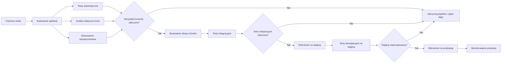

# Typowy pipeline CI/CD w Jenkinsie

```mermaid
flowchart LR
    A[Checkout kodu] --> B[Budowanie aplikacji]
    B --> C[Testy automatyczne]
    B --> D[Analiza statyczna kodu]
    B --> E[Skanowanie bezpieczeństwa]
    C --> F{Wszystkie kontrole zaliczone?}
    D --> F
    E --> F
    F -- Nie --> X[Zatrzymaj pipeline i zgłoś błąd]
    F -- Tak --> G[Budowanie obrazu Docker]
    G --> H[Testy integracyjne]
    H --> I{Testy integracyjne zaliczone?}
    I -- Nie --> X
    I -- Tak --> J[Wdrożenie na staging]
    J --> K[Testy akceptacyjne na staging]
    K --> L{Staging zaakceptowany?}
    L -- Nie --> X
    L -- Tak --> M[Wdrożenie na produkcję]
    M --> N[Monitorowanie produkcji]
```
