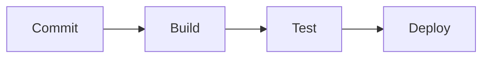

# Zadanie 6

## Prompt

Stwórz prosty diagram Mermaid pokazujący proces CI/CD: commit → build → test → deploy.

## Diagram

```mermaid
flowchart LR
    A[Commit] --> B[Build]
    B --> C[Test]
    C --> D[Deploy]
```
